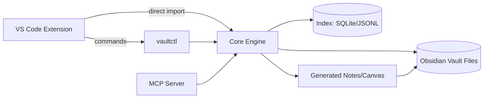

# The idea (in one sentence)
Write **one app** that becomes the “source of truth” for your Obsidian vault’s markdown (and canvases), while also exposing a **code-aware UI inside VS Code** (Cline-friendly) for generating/curating docs, linking tasks, and keeping everything consistent.

---

# What “completely managed by an app” should mean
If we’re serious about “managed,” the app needs to own these responsibilities:

1. **Vault indexing**
   - Fast scan of notes, frontmatter, links, tags, headings, tasks, embeds.
   - Incremental updates via file watcher.

2. **Markdown normalization + policy**
   - Enforce frontmatter schema, headings, file naming, link style, folder rules.
   - Auto-fixers (format, lint, reorganize, migrate).

3. **Graph + views (Obsidian-ish)**
   - Backlinks, outgoing links, tag graph, “unlinked mentions,” daily notes, etc.
   - Canvas generation (Obsidian `.canvas` JSON) for maps.

4. **Code-side blend**
   - Tie docs to repos, branches, ADO/GitHub issues, compose stacks, pipeline YAMLs.
   - Create “doc cards” from code metadata: endpoints, models, services, Docker stacks.

5. **AI/Cline integration**
   - Provide structured prompts + context packs.
   - Keep everything file-based so Cline can act on it naturally.
   - Optionally expose an **MCP server** so tools can query your vault programmatically.

---

# Recommended shape: “Core engine” + “VS Code UX”
Don’t start with “a big UI.” Start with a core engine that can be used by:
- VS Code extension (your daily driver)
- CLI (automation + pipelines)
- Optional local web UI (later)
- Optional Obsidian plugin (later)

## Components
- **Core** (Node/TS): vault indexing, schema, transforms, query engine
- **CLI**: `vaultctl scan`, `vaultctl lint`, `vaultctl fix`, `vaultctl canvas`, `vaultctl pack`
- **VS Code Extension**: panels, commands, quick-picks, “doc actions,” code-linking UI
- **MCP server** (optional): query notes, graph, tasks, generate canvases, export packs

---

# Data model: keep it file-native + add an index
Your vault stays **markdown + .canvas + attachments** (Obsidian-compatible).
Your app adds:
- `.vault/` (private app folder)
  - `index.sqlite` (or `index.jsonl`) for fast queries
  - `schemas/` (frontmatter schemas)
  - `policies/` (lint rules)
  - `generated/` (auto-generated notes, canvases)
  - `state.json` (hashes, last scan, etc.)

This keeps things:
- Git-friendly
- Obsidian-friendly
- Cline-friendly

---

# “Capture my entire Obsidian view” — what’s realistically capturable
Obsidian has a bunch of “views.” You can mimic most of them from vault data.

## Easy (pure vault parsing)
- File tree + metadata
- Backlinks / outgoing links
- Tag browser + tag graph
- Search (including regex)
- Task query (checkbox tasks)
- Daily notes patterns

## Medium (needs more parsing)
- Block references (`^blockid`)
- Embeds and transclusions
- Callout parsing + custom markdown features
- Dataview-style queries (you can implement a subset)

## Hard (but doable)
- Canvas maps (you can generate/edit `.canvas` JSON)
- Workspace layout/state (Obsidian stores app state; you can approximate, not replicate perfectly)
- Plugin-specific states (Dataview indexes, etc.)

**Pragmatic approach:** replicate the *useful* parts: graph, backlinks, tasks, canvases, and “project dashboards.”

---

# VS Code UX ideas (Cline-friendly)
These features keep you in VS Code while preserving Obsidian’s feel.

## 1) Vault Explorer panel
- Notes tree
- Tags
- “Recently touched”
- “Orphaned notes”
- “Broken links”

## 2) Graph + Canvas commands
- “Generate Canvas for Folder”
- “Generate Canvas for Project ID (CC-*, PH-*)”
- “Focus Graph on current file”

## 3) Code ↔ Docs linking
- “Attach note to repo path” (stores `repo:` + `path:` in frontmatter)
- “Create doc from selection” (extract method/class doc into a note)
- “Generate API docs pack” (collect controllers, endpoints, models into notes)

## 4) “Doc Actions” palette
- Lint/fix current note
- Normalize links
- Insert frontmatter template
- Convert checklist → tasks
- Stamp build/release notes

---

# MCP server layer (optional, but spicy)
If you want other tools (or agents) to query your vault:

**Example tools**
- `vault.search(query)`
- `vault.getNote(path|id)`
- `vault.getBacklinks(path)`
- `vault.getGraph(seed, depth, filters)`
- `vault.generateCanvas(scope, style)`
- `vault.buildContextPack(paths|query)`

This pairs extremely well with:
- Cline / agent workflows
- Your existing “Task View MCP” ideas
- Azure DevOps / GitHub integrations

---

# Implementation plan (phased, realistic)
## Phase 0 — Core scanning + index (1–2 weekends)
- Parse markdown frontmatter + links + headings + tasks
- Build local index (SQLite recommended)
- Provide CLI: scan/search/backlinks
- Add policy rules (naming, required frontmatter fields)

## Phase 1 — VS Code extension MVP
- Commands wired to CLI/core
- Sidebar “Vault Explorer”
- QuickPick search results
- “Lint/Fix current file” command
- “Generate Canvas from selection/folder”

## Phase 2 — Code-side blending
- Repo awareness: detect git root, branch, remote
- Frontmatter fields for repo linkage
- “Generate docs from code” (start with C# controller endpoints + TS types)
- Context pack generator for AI prompts

## Phase 3 — Obsidian parity boosters
- Unlinked mentions
- Better block refs / embeds
- Canvas editing (update positions, groupings, auto-layout)
- “Project dashboards” auto-generated notes + canvases

## Phase 4 — MCP server + automations
- MCP server exposing vault queries + generation tools
- Scheduled tasks: “rebuild index,” “fix broken links,” “export docs,” etc.

---

# Repo layout suggestion
```text
vault-forge/
  packages/
    core/                 # TS library: parse, index, graph, policies, transforms
    cli/                  # vaultctl commands
    vscode-extension/     # VS Code UI (webviews, commands)
    mcp-server/           # optional MCP server wrapper around core
  docs/
  samples/
  .editorconfig
  package.json (pnpm workspace)
```

---

# Frontmatter schema (example)
Keep it strict + enum-driven (your preference). Example:

```yaml
---
id: CC-DOC-0123
type: doc          # enum: doc|spec|howto|runbook|note|log
project: CC        # enum: CC|PH|ADO|LAB|...
status: active     # enum: draft|active|deprecated
repo:
  name: channelcheevos
  path: apps/cc-client
links:
  ado: https://dev.azure.com/.../workitems/edit/123
  github: https://github.com/.../issues/456
tags: [docs, dashboard, keycloak]
---
```

---

# Mermaid: how the parts talk


---

# “Series of these” — what you’ll ship as repeatables
Once the core is in place, you’ll be able to create repeatable “generators”:

- **Project skeleton note sets** (README + runbook + deployment + links)
- **Canvas maps** per project/folder/tag
- **Release note bundles** (per version tag)
- **Integration packs** (Keycloak settings snapshot, compose stack docs, etc.)
- **On-stream task views** (ties into your Task View MCP idea)

---

# Next move (no ceremony)
If you want the fastest win: build **Phase 0 + Phase 1** as a TS monorepo:
- core indexer
- CLI
- a simple VS Code sidebar that can search + open notes + show backlinks

That’s enough to feel “Obsidian, but code-first” without biting off the whole UI universe.
